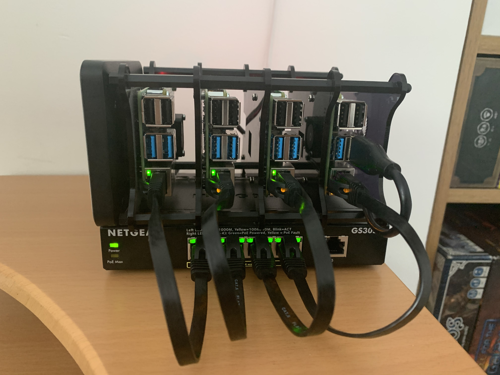
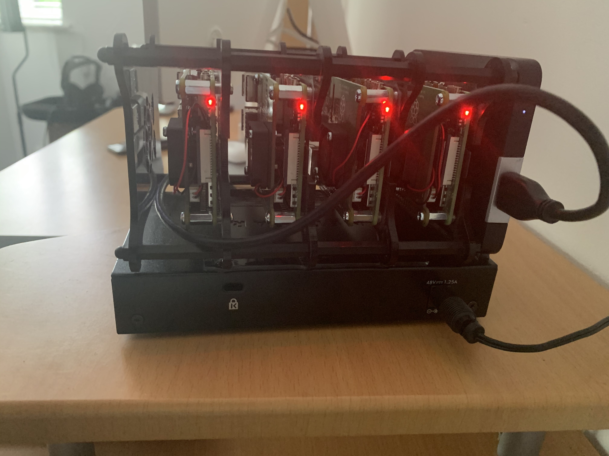
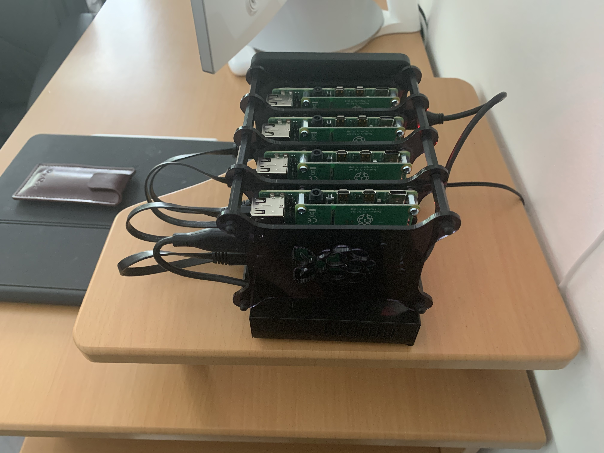

# Kubernetes on Raspbian

Build a [Kubernetes](https://kubernetes.io/) ([k3s](https://github.com/rancher/k3s)) cluster with RPis and utilize [GitOps](https://www.weave.works/technologies/gitops/) for managing cluster state.

Thanks to the following pages

* https://gist.github.com/elafargue/a822458ab1fe7849eff0a47bb512546f
* https://github.com/onedr0p/homelab-gitops
* https://github.com/billimek/k8s-gitops

## Pre-reqs:

* This was done using a cluster of 4 x RPi 4 4GB
* All Pi's are connected via a local ethernet switch on a 10.0.0.0/24 LAN
* The master node connects to the outside world on WiFi, and provides NAT for the the rest of the cluster.

## Directory layout description

```bash
.
│   # Flux will scan and deploy from this directory
├── ./deployments
│   # Initial setup of the cluster
├── ./setup
│   │   # Scripts for setting things up
│   ├── ./bin
│   │   # Config for RPI
│   └─ ./nodes
│   # Docker builds for ARM devices
└── ./docker
```

## Network topology

| IP           | Function              | MAC Address       |
| ------------ | --------------------- | ----------------- |
| 192.168.1.1  | Router                |                   |
| 192.168.1.18 | Master wifi interface |                   |
| 10.0.0.0/24  | k3s cluster CIDR      |                   |
| 10.0.0.1     | k3s master (master)   | dc:a6:32:67:76:f1 |
| 10.0.0.2     | k3s worker (node-1)   | dc:a6:32:67:77:06 |
| 10.0.0.3     | k3s worker (node-2)   | dc:a6:32:67:76:b8 |
| 10.0.0.4     | k3s worker (node-3)   | dc:a6:32:67:77:3e |

## Hardware list

* 4 x [Raspberry Pi 4 Model B 4GB](https://thepihut.com/products/raspberry-pi-4-model-b?variant=20064052740158)
* 4 x [Raspberry Pi PoE Hat](https://thepihut.com/products/raspberry-pi-power-over-ethernet-poe-hat)
* 4 x [SanDisk Ultra microSDHC Memory Card](https://www.amazon.co.uk/gp/product/B073K14CVB)
* 4 x [15cm Flat Cat 6 cables](https://www.aliexpress.com/item/32842014328.html)
* 4 x [Low profile heatsinks](https://thepihut.com/products/raspberry-pi-heatsink)
* [Jun_Electronic 4 Layers Stackable Case](https://www.amazon.co.uk/gp/product/B07F6Y1MJ6)
* [NETGEAR 5-Port Gigabit Ethernet PoE Switch](https://www.amazon.co.uk/dp/B072BDGQR8/)
* [Western Digital My Passport for Mac 500GB](https://www.johnlewis.com/wd-my-passport-for-mac-portable-hard-drive-usb-3-0-500gb-silver/p645128)




