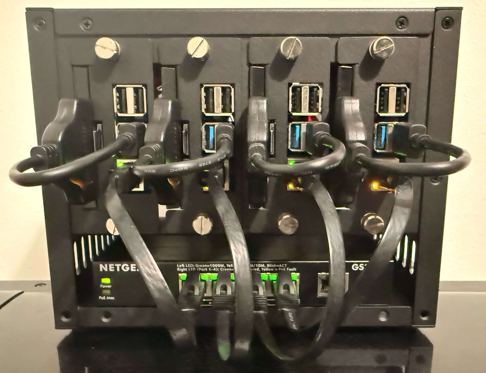

# Kubernetes on Raspberry Pis

Build a [Kubernetes](https://kubernetes.io/) ([K3s](https://github.com/rancher/k3s)) cluster with Raspberry Pis, using [Anisble](https://www.ansible.com) to bootstrap the machines, and utilizing [GitOps](https://www.weave.works/technologies/gitops/) for managing cluster state.



## Prerequisites:

* This was done using a cluster of 4 x RPi 4 4GB
* All Pi's are connected via a local ethernet switch on a 10.0.0.0/24 LAN
* The master node connects to the outside world on WiFi, and provides NAT for the rest of the cluster.

## Directory layout description

```bash
.
│   # Ansible playbooks to bootstrap the cluster
├── ./ansible
│   # Docker builds for ARM devices
├── ./docker
│   # Flux will scan and deploy from this directory
├── ./manifests
│   # Scripts and config for setting up the Raspberry Pis
└── ./scripts
    │   # Cloud-init config for Raspberry Pi Imager
    └─ ./cloud-init
```

## Network topology

| IP              | Function              | MAC Address       |
| --------------- | --------------------- | ----------------- |
| 192.168.115.1   | Router                |                   |
| 192.168.115.193 | Master wifi interface |                   |
| 10.0.0.0/24     | k3s cluster CIDR      |                   |
| 10.0.0.1        | k3s master (master)   | dc:a6:32:67:76:f1 |
| 10.0.0.2        | k3s worker (node-1)   | dc:a6:32:67:77:3e |
| 10.0.0.3        | k3s worker (node-2)   | dc:a6:32:67:76:b8 |
| 10.0.0.4        | k3s worker (node-3)   | dc:a6:32:67:77:06 |

## Hardware list

* 4 x [Raspberry Pi 4 Model B 4GB](https://thepihut.com/products/raspberry-pi-4-model-b?variant=20064052740158)
* 4 x [Raspberry Pi PoE Hat](https://thepihut.com/products/raspberry-pi-power-over-ethernet-poe-hat)
* 4 x [SanDisk Ultra microSDHC Memory Card](https://www.amazon.co.uk/gp/product/B073K14CVB)
* 4 x [15cm Flat Cat 6 cables](https://www.aliexpress.com/item/32842014328.html)
* 4 x [Low profile heatsinks](https://thepihut.com/products/raspberry-pi-heatsink)
* 4 x [WD Green 240GB 2.5" SSD](https://thepihut.com/products/wd-green-240gb-2-5-ssd)
* 4 x [SSD to USB 3.0 Cable](https://thepihut.com/products/ssd-to-usb-3-0-cable-for-raspberry-pi)
* [Uctronics Cluster Enclosure V3.0](https://thepihut.com/products/uctronics-complete-enclosure-for-raspberry-pi-clusters-v3-0)
* [MicroSD Extender Set for Uctronics Cluster Cases](https://thepihut.com/products/microsd-extender-set-4-pieces)
* [NETGEAR 5-Port Gigabit Ethernet PoE Switch](https://www.amazon.co.uk/dp/B072BDGQR8/)

# Bootstrapping the cluster

1. Ensure that [Raspberry Pi Imager](https://www.raspberrypi.com/software/) is installed
2. Run `make flash` to flash the SSD drive for each RPI using RPI Imager. It will flash with `Ubuntu Server 24.04.3 LTS (64-bit)` and copy the `network-config` & `user-data` relevant to the node to the SSD.
3. Edit `~/.ssh/config` on the local machine to include the following
```
Host master
    Hostname master.local # Or the IP address
    User ubuntu

Host node-1
    Hostname 10.0.0.2
    ForwardAgent yes
    User ubuntu
    ProxyCommand ssh -A master -W %h:%p

Host node-2
    Hostname 10.0.0.3
    ForwardAgent yes
    User ubuntu
    ProxyCommand ssh -A master -W %h:%p

Host node-3
    Hostname 10.0.0.4
    ForwardAgent yes
    User ubuntu
    ProxyCommand ssh -A master -W %h:%p
```
4. Plug in the master RPI and let it boot
5. Run `make master` to set up the master
6. Plug in the 3 remaining nodes and let them boot
7. Run `make workers` to set up the worker nodes
8. Run `make install` to set up K3s
9. Once master has finished you can run `make config` to retrieve the kubeconfig. Use `kubectl --kubeconfig=k3s_config get nodes` to see that the nodes have been provisioned.
